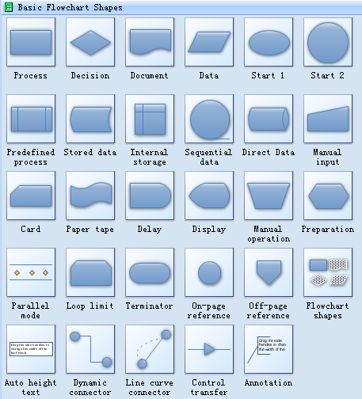

Aqui encontraremos la documentacion correspondiente a la arquitectura de las APIs.

## Simbologia



!!! info "Simbologia en Markdown"

    Haciendo click [aqui](https://mermaid-js.github.io/mermaid/#/flowchart) pueden acceder a la documentacion para hacer diagramas con Markdown

---

## Veamos unos ejemplos

=== "API Anulacion Meli V1"

    ```mermaid
    flowchart TD
      A([API Autorizaciones Meli]) --> B[Validar request]
      B --> C{Error?}
      C --> |Si| E[Validar envio]
      C --> |No| D(400)
      E --> F{Existe?}
      F --> |Si| G[Intenta anular preenvio]
      F --> |No| N(400)
      G --> H{Se anulo?}
      H --> |No| I[Intenta rescatar envio]
      H --> |Si| J(200)
      I --> K{Se efectua devolucion?}
      K --> |Si| L(200)
      K --> |No| M(400)
    ```

=== "API Anulacion Meli V2"

    ```mermaid
    flowchart LR
      A([API Autorizaciones Meli]) --> B[Validar request]
      B --> C{Error?}
      C --> |Si| E[Validar envio]
      C --> |No| D(400)
      E --> F{Existe?}
      F --> |Si| G[Intenta anular preenvio]
      F --> |No| N(400)

    ```
    ```mermaid
    flowchart LR
      G[Intenta anular preenvio] --> H{Se anulo?}
      H --> |No| I[Intenta rescatar envio]
      H --> |Si| J(200)
      I --> K{Se efectua devolucion?}
      K --> |Si| L(200)
      K --> |No| M(400)
    ```

=== "Drive"

    <iframe src="https://drive.google.com/file/d/1V7Eb9UryNrpsLLrGzbMx64iohaiYVd-b/preview" width="100%" height="480" allow="autoplay"></iframe>

=== "Diagrams Prueba"

      <iframe frameborder="0" style="width:100%;height:244px;" src="https://viewer.diagrams.net/?tags=%7B%7D&highlight=0000ff&edit=_blank&layers=1&nav=1#G1wklmHH7UBV12aGsNc8qEZ4gS6lhONQWR"></iframe>

=== "API Numeracion"

    <iframe frameborder="0" style="width:100%;height:948px;" src="https://viewer.diagrams.net/?tags=%7B%7D&highlight=0000ff&edit=_blank&layers=1&nav=1&page-id=BD08k3y9bfzbHYxVkXD_&title=Arquitectura%20APIs#Uhttps%3A%2F%2Fdrive.google.com%2Fuc%3Fid%3D1Rv4ZWtRFGPFHZo-I-qP28DqMJZhohxNl%26export%3Ddownload"></iframe>
